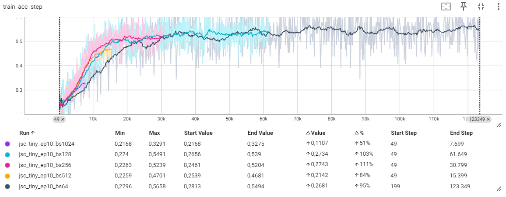

# Practical 1 - Mauro Marino

## Lab 1

The first three tasks of this lab involved exploring the dynamics and consequences that arise when varying some basic hyperparameters that are crucial to model training in the deep learning setting. For each of them several trainings were performed, each using a different value from the spectrum of possible ones generally used when training neural networks, with the purpose of exploring the differences in training curves and training/validation performance. The model used for these experiments is jsc-tiny, which is constituted by a very small architecture comprising only 117 parameters (See Figure 4, (a)).

### Varying Batch Size

The batch size determines how many samples are passed to the model at each training/inference iteration. Large values are generally good to speed up the training/inference process, especially if the model runs on GPUs, since it enables better parallelization. Anyway, one major drawback lies in more data samples being loaded on the hardware RAM at the same time, and this can lead to OOM errors if the overall batch is too heavy compared to hardware capacity; besides, too large batch size lead to larger network updates during training, with the risk of the optimizer getting stuck in a local minimum. Lower batch sizes instead allow to fit less capable hardware, and can potentially lead to a more stable optimization process robust to local minima. 

Figure 1 shows tensorboard logs of training accuracy, validation accuracy, and training time using different batch sizes; we can definitely notice a reduction in validation accuracy as the batch size increase, although the training accuracy increases; most likely, the beneficial noise-injection effect of small batch sizes has an enhancing effect on the overall learning process, leading to overfitting in case of too high batch size values. 

|  |
|:--:|
|  |
|  |
| *Figure 1 - Batch Sizes Comparison* |

It is anyway worth noticing the notable increase in training time to fit the same network when using low batch size values, as expected.

### Varying Maximum Epoch Number

An epoch consists in a whole training dataset being passed to the network exactly once; more epochs allow the model to reiterate over the same dataset and update its weights accordingly, thus suggesting that a higher number of epochs leads to better learning and more desirable final results; anyway, if a too low number of epochs may lead to underfitting, setting this number too high is likely to cause overfitting, with the network learning not only underlying patterns in the data but also the noise inherently existing in the training set, with consequent poor generalization on unseen data. Since fine tuning the epoch number is in practice very often expensive in terms of computational effort, techniques have been devised that aim at saving the best-performing model weights before reaching the chosen maximum epoch number (e.g., Early Stopping).

Figure 2 shows the training and validation curves with different number of epochs; intuitively, the only change is brought by the higher-epochs trainings showcasing increased training and validation accuracy. There is no signal of divergence even with the highest number of epochs (20), suggesting that the model is potentially underfitting; the learning rate may be too low, as well (1e-5), and a higher value is likely to be beneficial, as well, given the displayed curves.

|  |
|:--:|
|  |
| *Figure 2 - Epoch Number Comparison* |


### Varying Learning Rate

The learning rate determines how fast a network learns, i.e., the magnitude of weight updates after each training step; setting a high value for this hyperparameter leads to faster learning, but implies larger weight updates that may lead to miss the minimum and oscillate around it or, even worse, to divergence. A lower learning rate is more likely to converge to a minimum, but requires a higher number of epochs to train adequately; besides, a too low learning-rate may lead the optimizer to get stuck in a local minimum since the magnitude of weight updates would not be powerful enough to escape it.

Learning rate and batch size are closely related to one another: small batch sizes inherently introduce some noise during training as gradient computations and backward propagation are performed with a smaller portion of the available training set; this can lead to better generalization power, but using a lower learning rate is desirable as well in order to keep a degree of training stability. Conversely, using a larger batch size allows for larger learning rates, but with an increased training instability. It is also worth noticing how both affect training time as larger batch sizes are more computationally efficient, especially when the train is powered by hardware that enables parallelization (such as a GPU), and higher learning rates speed up the learning process. Various techniques have been developed that allow to dynamically update the learning rate during training to mitigate the risk of getting stuck in local minima or oscillating around an optimum (e.g., Learning Rate Warm-up, Learning Rate Scheduling).

Figure 3 shows extreme benefits in using a larger learning rate compared to the baseline 1e-5, confirming the underfitting hypothesis of the previous point. The highest tried learning rate (5e-4) indeed shows the best validation accuracy (around 70%) we experienced in these experiments. More advanced hyperparameter tuning techniques (e.g., Grid Search) allowing for the exploration of multiple hyperparameter combinations will be explored in Lab 3.

|  |
|:--:|
|  |
| *Figure 3 - Learning Rates Comparison* |

### Less-Tiny Network: Tiny Network x10

For this task, a larger network was implemented having around 10x more parameters than the jsc-tiny architecture used for the previous experiments. The network is composed by two more BatchNorm+ReLU+Linear blocks (see Figure 4 (b) for reference), and has around 1300 parameters in total. To implement it and make it easily accessible using the chop flow, "__init__.py" files were changed in both physical and physical/jet_substructure folders.

|  |
|:--:|
| *Figure 4 - Tiny Networks* |

### Less-Tiny Network Performance

Once both jsc-tiny and jsc-less-tiny networks have been trained using the same baseline set of hyperparameters, it gets clear from Figure 5 that the larger architecture version has an edge; specifically, with around 7% higher validation accuracy (54% vs 47%). The shallow curve displaying JSC-Less-Tiny validation accuracy suggests very slow learning but there is no overfitting, hence the observation made in the previous point about the learning rate being too low may hold here, as well.

|  |
|:--:|
|  |
| *Figure 5 - JSC-Tiny vs JSC-Less-Tiny Comparison* |

## Lab 2

### report_graph_analysis_pass Functionality

The report_graph_analysis_pass is a function that takes as input the computational graph associated to a neural network (MaseGraph object) and generates a report on the structure and composition of said computational graph: indeed an invaluable functionality for the purpose of debugging and optimizing deep learning models, and potentially useful for debugging efforts, as well. The function takes, as optional argument, also a dictionary specifying the destination into which the report should be saved, and only prints the report if no file name is provided. 
The function first initiates an empty string 'buff' that accumulates report contents, then first converts the computational graph representation into a string that is appended to 'buff'. A 'count' dictionary is then initialized with the purpose of tracking the occurrence of different operation types in the computational graph; these operations appear in torch.fx: 
    'placeholder' represents the inputs to the graph. Specifically, a neural network having a single non-self input (e.g., x) will have placeholder=1;
    'get_attr' accesses an attribute of an object, and is typically used for fetching parameters or submodules of 'nn.Module';
    'call_function' represents a call to a standalone function in the graph;
    'call_method' is a method call on an object within the graph;
    'call_module' represents a call to a module ('nn.Module'), potentially indicating the use of a neural network layer or block;
    'output' marks the output of the graph, corresponding to the 'return' statement.

### profile_statistics_analysis_pass & report_node_meta_param_analysis_pass Functionalities

"profile_statistics_analysis_pass" takes as input the computational graph associated to a neural network (MaseGraph object) and performs a detailed statistical  analysis on it. The analysis involves collecting and profiling various statistics related to weights and attivations within the graph: when called, the function modifies the input graph to include these statistics and returns the modified graph alongside an empty dictionary, suggesting that the purpose of this pass is to augment the graph with additional (profiling). The function first calls the "graph_iterator_register_stat_collections", which initializes the collection of statistics for weight and activation nodes based on the criteria specified in the various parameters taken from an input dictionary required by the profile_statistics_analysis_pass:
    'by' is the criterion for selecting the nodes for profiling (e.g., by 'type');
    'target_weight_nodes' and 'target_act_nodes' are lists specifying the nodes whose weights and activations are of interest (e.g., ['linear'] and ['relu']);
    'weight_statistics' and 'act_stats' expect a dictionary specifying which statistics are to be computed for weights and activations, respectively (e.g., {'variance_precise': dict}, {'range_quantile': dict});
    'profile_output_act' is a boolean indicating whether to profile activations at the output of the graph, which defaults to False.
"graph_iterator_profile_weight" profiles the weights of the nodes within the graph, while "graph_iterator_profile_act" profiles the activation: it employs an 'input_generator' to feed input into the graph, and 'num_samples' to determine the number of samples for profiling, both included in the aforementioned dictionary of parameters. Finally, "graph_iterator_compute_and_unregister_stats" takes the graph augmented up to this point and finalizes the computation of these statistics.
By profiling weights and activations, one could identify potential issues like parameter redundancy or inefficient activation patterns; besides, such a tool could be helpful to guide model pruning, quantization, or architectural adjustments to improve performance or efficiency.

"report_node_meta_param_analysis_pass" function is designed to analyze and report on the meta parameters associated with the nodes of an input computational graph associated to a neural network (MaseGraph object): alongside with the graph, the function takes as input an optional dictionary of arguments to customize the analysis, and eventually outputs the analyzed graph alongside an empty dictionary. As per the optional parameters:
    "which" specifies the categories of meta parameters to include in the report;
    "save_path" specifies a path to save the table, and defaults to None.
Specifically, the function constructs a list of headers for the report table, dynamically including columns based on the selected categories of parameters, in addition to always-included columns like "Node name", "Fx Node op", "Mase type", "Mase op". It then iterates over each node in the input graph, compiling information about the node into rows for the report: this includes the node's name, operation type, and meta parameters specific to the MaseGraph, all properly formatted. 
This function can be especially useful to get a nuanced understanding of how each node operates and interacts within the graph, potentially across different environments (e.g., different hardware and software configurations).

### quantize_transform_pass

The "quantize_transform_pass" takes as input the graph, and an optional dictionary of arguments; among these arguments, the type of node onto which to apply quantization can be specified. In our example, only nodes of type "linear" were specified, henceforth the quantization pass transformed those nodes only (3 linear layers overall). Anyway, more could be specified for a single pass to transform multiple different OPs.

### Traverse mg & ori_mg

Since we are now applying transformations on the computational graphs (thus actually changing them), it's desirable to have a way to traverse two MaseGraphs, an original and a transformed one, and highlight changed nodes in a systematic way. The summarize_quantization_analysis_pass implementation provides interesting clues on what methods MASE provides to inspect inherent characteristics of MaseGraph nodes, especially when dealing with quantization transforms: the "get_mase_op", "get_mase_target" and "get_node_actual_target" methods from chop.passes.graph.utils are used to investigate whether the node targets' types match, and a summary of the modified node and module change is returned if they don't. Follows the function that executes such a comparison.

```python
def compare_graph_nodes(ori_mg, mg):
  # Traverse the graph 
  for transformed_mg_node, original_ms_node in zip(mg.fx_graph.nodes, ori_mg.fx_graph.nodes):

    # Check if the types of the actual targets of the nodes are different
    if (type(get_node_actual_target(transformed_mg_node)) != type(get_node_actual_target(original_ms_node))):
        
        # Get the types of the original and transformed nodes
        original_node_type = type(get_node_actual_target(original_ms_node))
        quantized_node_type = type(get_node_actual_target(transformed_mg_node))

        # Same for both original and transformed MaseGraph
        print(f' Node Name: {transformed_mg_node.name}')  
        print(f' Node Mase Type: {get_mase_type(transformed_mg_node)}') 
        print(f' Node Mase Operation: {get_mase_op(transformed_mg_node)}')  
        # Module difference
        print(f' Original Module: {original_node_type}')
        print(f' New Module: {quantized_node_type}\n')
```

|  |
|:--:|
| *Figure 6 - Traverse Quantized MG and Original MG - Output* |

Figure 6 shows the output obtained when running the "compare_graph_nodes" function after applying quantization on the jsc-tiny network; it can be easily noticed that the only difference between the two graphs (quantized vs original) is in the linear layer in seq_blocks_2, which is now a LinearInteger module instead of a Linear. As expected, there are no other nodes that differ from the original MaseGraph to the quantized one.


### Quantize Less-Tiny Network

The same quantization flow used for the Jsc Tiny network was applied on the 10x larger network version, devised in Lab 1. As the number of Linear layers increased from 1 to 3, there is an increase in the number of quantized layers. Anyway, no different layers than Linear have been used in the enhanced Jsc Tiny (Less-Tiny) network, hence no adaptation of pass_args was required.

### Show & Verify Effective Quantization

To verify that effective quantization has been performed, we can inspect the computational graph of the original network versus the (supposedly) quantized one, specifically extracting layers' weights and comparing their dtype: we expect layers from "mg" (the new computational graph) to have a lower-precision data type compared to layers from "ori_mg" (the original computational graph); according to the args of the quantization experiment we performed, we expect data, layer weight, and layer bias to be all quantized and turned into integers with [8, 4] precision shape, whilst keeping all the other blocks unchanged. 
The following code allows to create a tabular representation of the quantization result.

```python
from tabulate import tabulate

# Initialize an empty list to store node comparison data
comparison_data = []
comparison_weight = []
comparison_bias = []

for node_ori, node_quant in zip(ori_mg.fx_graph.nodes, mg.fx_graph.nodes):
    # Extracting original and quantized model information
    try:
      row_data = [
          node_ori.meta['mase'].node,
          node_ori.meta['mase'].parameters['common']['mase_op'],
          node_ori.meta['mase'].parameters['common']['args']['data_in_0'].get('type', 'N/A'),
          node_ori.meta['mase'].parameters['common']['args']['data_in_0'].get('precision', 'N/A'),
          node_quant.meta['mase'].parameters['common']['args']['data_in_0'].get('type', 'N/A'),
          node_quant.meta['mase'].parameters['common']['args']['data_in_0'].get('precision', 'N/A'),
      ]
      row_weight = [
          node_ori.meta['mase'].node,
          node_ori.meta['mase'].parameters['common']['mase_op'],
          node_ori.meta['mase'].parameters['common']['args']['weight'].get('type', 'N/A'),
          node_ori.meta['mase'].parameters['common']['args']['weight'].get('precision', 'N/A'),
          node_quant.meta['mase'].parameters['common']['args']['weight'].get('type', 'N/A'),
          node_quant.meta['mase'].parameters['common']['args']['weight'].get('precision', 'N/A'),
      ]
      row_bias = [
          node_ori.meta['mase'].node,
          node_ori.meta['mase'].parameters['common']['mase_op'],
          node_ori.meta['mase'].parameters['common']['args']['bias'].get('type', 'N/A'),
          node_ori.meta['mase'].parameters['common']['args']['bias'].get('precision', 'N/A'),
          node_quant.meta['mase'].parameters['common']['args']['bias'].get('type', 'N/A'),
          node_quant.meta['mase'].parameters['common']['args']['bias'].get('precision', 'N/A')
      ]
    except:
      row_data = [
          node_ori.meta['mase'].node,
          node_ori.meta['mase'].parameters['common']['mase_op'],
          "N/A",
          "N/A",
          "N/A",
          "N/A",
      ]
      row_weight = [
          node_ori.meta['mase'].node,
          node_ori.meta['mase'].parameters['common']['mase_op'],
          "N/A",
          "N/A",
          "N/A",
          "N/A",
      ]
      row_bias = [
          node_ori.meta['mase'].node,
          node_ori.meta['mase'].parameters['common']['mase_op'],
          "N/A",
          "N/A",
          "N/A",
          "N/A",
      ]
    comparison_data.append(row_data)
    comparison_weight.append(row_weight)
    comparison_bias.append(row_bias)

headers_data = ["Node", "MASE OP", "Original Data DType", "Original Data Precision", "Quantized Data DType", "Quantized Data Precision"]
headers_weight = ["Node", "MASE OP", "Original Weight DType", "Original Weight Precision", "Quantized Weight DType", "Quantized Weight Precision"]
headers_bias = ["Node", "MASE OP", "Original Bias DType", "Original Bias Precision", "Quantized Bias DType", "Quantized Bias Precision"]

table_data = tabulate(comparison_data, headers=headers_data, tablefmt="grid")
print(table_data)
print("\n")
table_weight = tabulate(comparison_weight, headers=headers_weight, tablefmt="grid")
print(table_weight)
print("\n")
table_bias = tabulate(comparison_bias, headers=headers_bias, tablefmt="grid")
print(table_bias)
```

Executing it on our code shows that the three Linear layers were effectively quantized as expected, displaying the original weights and biases dtype and precision versus their updated ones. Anyway, it is not possible to directly access quantized weights with the aforementioned code, but only their precision; then following snippet instead leverages on the w_quantizer of LinearInteger objects (i.e., the layers upon which quantization has been appied) to actually show effective quantization has been performed. After printing the original vs quantized weights, it plots stacked histograms displaying the evident difference between the two sets of weights, as showed in Figure 7.

```python
for ori_node, quant_node in zip(ori_mg.fx_graph.nodes, mg.fx_graph.nodes):
  if type(quant_node.meta['mase'].module).__name__ == "LinearInteger":
    print(f"Original Weights - Layer {quant_node.meta['mase'].module}")
    print(f"\t{quant_node.meta['mase']['common']['args']['weight']}")
    print(f"Quantized Weights - Layer {quant_node.meta['mase'].module}")
    print(f"\t{quant_node.meta['mase'].module.w_quantizer(quant_node.meta['mase'].module.weight)}")

import matplotlib.pyplot as plt
tensor_original = quant_node.meta['mase']['common']['args']['weight']['value'].detach()
tensor_quantized = quant_node.meta['mase'].module.w_quantizer(quant_node.meta['mase'].module.weight).detach()


flat_tensor_original = tensor_original.flatten()
flat_tensor_quantized = tensor_quantized.flatten()

# Plot histograms
plt.hist(flat_tensor_original.numpy(), bins=50, alpha=0.5, label='Original Weights')
plt.hist(flat_tensor_quantized.numpy(), bins=50, alpha=0.5, label='Quantized Weights')
plt.xlabel('Value', fontsize=16)
plt.ylabel('Frequency', fontsize=16)
plt.legend(loc='upper right')
plt.title('Histogram Comparison: Original vs Quantized Weights')
plt.show()
```
    
|  |
|:--:|
| *Figure 7 - Original vs Quantized Weights Histogram* |

### Command Line Interface Quantization

The chop flow allows to perform quantization directly from command line, as well; an adapted .toml file (jsc_less_tiny_by_type_L2Q7.toml) was created to perform the same quantization as done locally by simply calling the "!./ch transform --config configs/examples/jsc_less_tiny_by_type_L2Q7.toml --task cls --accelerator='cpu'" command, and the results are the same we previously experienced, with all the (3) linear layers being changed (See Figure 8).

|  |
|:--:|
| *Figure 8 - Command-line Interface Quantization Result* |

### Optional: FLOPs Count & BitOPs Count Pass

We now want to implement a new pass that counts the number of FLOPs (floating-point operations) and BitOPs (bit-wise operations). To do so, we use a modified version of the calculate_modules function contained in the calc_modules.py file. We extend it to accomodate for BatchNorm1d, and add an option to account for the bias in the FLOPs computation, as well; then we extract in_data and out_data from the computational graph of the "Less-Tiny" JSC network we trained in Lab 1; making use of the "get_node_actual_target" util function, we aggregate the computations obtained with "calculate_modules" and get a final FLOPs amount representing model complexity. A multiplier is computed according to the specific input's data type; eventually, a similar computation as the one used to compute FLOPs is performed that multiplies each term by the appropriate multiplier, yielding the number of BitOPs; the BitOPs computation methodology is similar to the one used by Yang & Jin (FracBits: Mixed Precision Quantization via Fractional Bit-Widths, 2020). 
It's worth noticing that the number of FLOPs does not inherently change when applying quantization: the number of operations performed by the model remains unchanged, despite the data used in such operation is supposedly lighter. On the other hand, BitOPs decrease when dealing with quantized models since the involved data is represented represented using fewer bits. Follows the code snippet that performs the pass that, given a computational graph, yields its FLOPs and BitOPs.

```python
from chop.passes.graph.utils import get_node_actual_target
from chop.passes.graph.analysis.flop_estimator.calculator.calc_modules import calculate_modules # modified to account for BatchNorm1d as well

def calculate_modules(module, node, in_data, out_data, include_bias=True):
    if isinstance(module, torch.nn.Linear):
        # One computation per weight, for each batch element.

        assert len(in_data) == 1
        batch = in_data[0].numel() / in_data[0].shape[-1]

        multipliers = {
            "weight_multiplier" : node.meta['mase'].parameters['common']['args']['weight']['precision'][0],
            "bias_multiplier" : node.meta['mase'].parameters['common']['args']['bias']['precision'][0],
            "data_multiplier" : node.meta['mase'].parameters['common']['args']['data_in_0']['precision'][0]
        }
      
        if include_bias:
          #multipliers = get_multipliers(weight=module.weight, bias=module.bias, data=in_data[0])

          computations = ( module.weight.numel() + module.bias.numel() ) * batch
          bitops = ( (module.weight.numel() * multipliers['weight_multiplier']) + (module.bias.numel() * multipliers['bias_multiplier']) ) * batch * multipliers['data_multiplier']
          backward_computations = module.weight.numel() * batch * 2
        else:
          #multipliers = get_multipliers(weight=module.weight, data=in_data[0])

          computations = module.weight.numel() * batch
          bitops = (module.weight.numel() * multipliers['weight_multiplier']) * batch * multipliers['data_multiplier']
          backward_computations = module.weight.numel() * batch * 2

        input_size = in_data[0].numel()
        output_size = out_data[0].numel()
        return {
            "total_parameters": module.weight.numel(),
            "bitops": bitops,
            "computations": computations,
            "backward_computations": backward_computations,
            "input_buffer_size": input_size,
            "output_buffer_size": output_size,
        }

    elif isinstance(module, torch.nn.modules.activation.ReLU) or isinstance(
        module, torch.nn.modules.activation.ReLU6
    ):
        multipliers = get_multipliers(data=in_data[0])
        # ReLU does a single negation check
        return {
            "total_parameters": 0,
            "computations": in_data[0].numel(),
            "bitops": in_data[0].numel() * multipliers['data_multiplier'],
            "backward_computations": in_data[0].numel(),
            "input_buffer_size": in_data[0].numel(),
            "output_buffer_size": out_data[0].numel(),
        }

    elif isinstance(module, torch.nn.LayerNorm):
        multipliers = {
            "data_multiplier" : node.meta['mase'].parameters['common']['args']['data_in_0']['precision'][0]
        }

        #multipliers = get_multipliers(data=in_data[0])

        computations = in_data[0].numel() * 5

        return {
            "total_parameters": 0,
            "computations": computations,
            "bitops": computations * multipliers['data_multiplier'],
            "backward_computations": in_data[0].numel() * 5,
            "input_buffer_size": in_data[0].numel(),
            "output_buffer_size": out_data[0].numel(),
        }

    elif isinstance(module, torch.nn.modules.batchnorm.BatchNorm1d):
        multipliers = {
            "data_multiplier" : node.meta['mase'].parameters['common']['args']['data_in_0']['precision'][0]
        }
        
        #multipliers = get_multipliers(data=in_data[0])

        # Accesses to E[x] and Var[x] (all channel size)
        total_parameters = 2 * module.num_features
        # (x-running_mean)/running variance
        # multiply by gamma and beta addition
        computations = 4 * in_data[0].numel()
        backward_computations = 4 * in_data[0].numel()

        return {
            "total_parameters": total_parameters,
            "computations": computations,
            "bitops": computations * multipliers['data_multiplier'],
            "backward_computations": backward_computations,
            "input_buffer_size": in_data[0].numel(),
            "output_buffer_size": out_data[0].numel(),
        }
    else:
        print("Unsupported module type for analysis:", type(module))


model_name = 'jsc-less-tiny'

CHECKPOINT_PATH = "/content/drive/MyDrive/AppliedMachineLearning/AdvancedDeepLearningSystems/MASErepo2/mase2/mase_output/jsc_tinyX10/software/training_ckpts/best_ep10_bs256.ckpt"
model_info = get_model_info(model_name)
model = get_model(
    model_name,
    task="cls",
    dataset_info=data_module.dataset_info,
    pretrained=False)

model = load_model(load_name=CHECKPOINT_PATH, load_type="pl", model=model)

input_generator = InputGenerator(
    data_module=data_module,
    model_info=model_info,
    task="cls",
    which_dataloader="train",
)

dummy_in = next(iter(input_generator))
_ = model(**dummy_in)

mg = MaseGraph(model=model)
mg, _ = init_metadata_analysis_pass(mg, None)
mg, _ = add_common_metadata_analysis_pass(mg, {"dummy_in": dummy_in})


from chop.passes.graph.utils import get_node_actual_target
#from chop.passes.graph.analysis.flop_estimator.calculator.calc_modules import calculate_modules # modified to account for BatchNorm1d as well

def computational_complexity_report_pass(graph, include_bias=True):
  store_data = {}
  for node in graph.fx_graph.nodes:
    try:
      in_data = (node.meta['mase'].parameters['common']['args']['data_in_0']['value'],)
    except KeyError:
      in_data = (None,)
    out_data = (node.meta['mase'].parameters['common']['results']['data_out_0']['value'],)
    

    module = get_node_actual_target(node)
    if isinstance(module, torch.nn.Module):
      data = calculate_modules(module, node, in_data, out_data, include_bias)
      
      store_data[module] = data

  count_flops = 0
  count_bitops = 0
  for key in store_data.keys():
    count_flops += store_data[key]['computations']
    count_bitops += store_data[key]['bitops']
  print(f"Total FLOPs: {count_flops}; Total BitOPs: {count_bitops}")
  return {
      "flops": count_flops,
      "bitops": count_bitops,
          }

```


