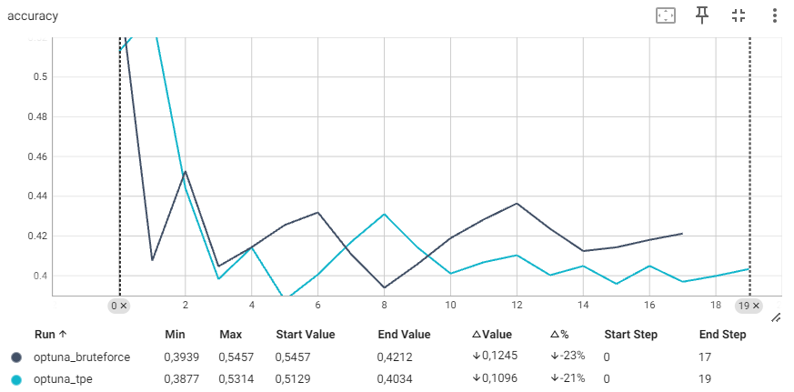
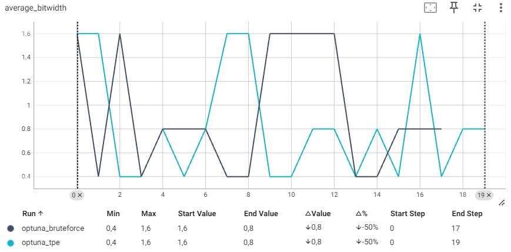
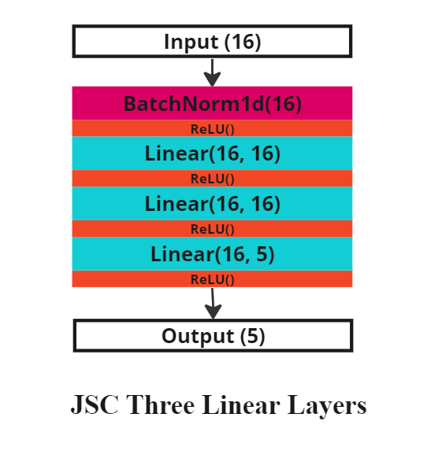
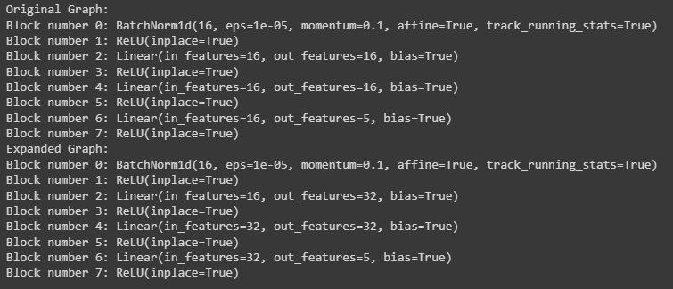

# Practical 2 - Mauro Marino

## Lab 3

### Search Process Quality Metrics: Overview

The search process consists in the execution of multiple experiments employing several different values of one or more tunable parameters and the evaluation of the performed experiments against a quality metric; one could for example want to find the data_in_frac_width and w_in_frac_width combination that maximizes classification accuracy. Anyway, maximizing model predictive power is not always the priority, for example in settings in which efficiency matters; besides, some hyperparameters may not even impact predictive power and would thus not be meaningfully tuned if using metrics that reflect such a characteristic (e.g., accuracy), requiring instead efficiency-oriented metrics. Eventually, some hyperparameter tuning settings may require a careful balance between two or more metrics, ending up with metrics that give insights concerning the tradeoff between several different aspects of model evaluation; an example may be choosing a good batch_size to train a deep learning model, a choice that would require accounting for model predictive power, training speed, and required RAM: increasing batch_size indeed leads to faster training, but too large batch_size would imply loading a too high amount of data on the used hardware, with a consequent RAM overload and potential OOM errors, and different batch_size values may lead to varying predictive power as well. 
Let us explore additional metrics that serve different purpose than solely assessing predictive power.
* Latency: measures the time it takes for the model to make a single prediction; this metric is crucial for assessing the model ability to operate in real-time applications, where rapid decision making is essential. Hyperparameter configurations that reduce latency without significantly compromising accuracy can thus be highly desirable;
* Model Size: the storage space required for the model, including both its parameters and architecture. A smaller model size is beneficial for deploying models in environments with limited storage capacity, such as mobile or embedded devices, and various techniques (e.g., pruning, quantization, ...) exist that aim at reducing model size without (or limited) decrease in predictive power;
* Inference Time: similar to latency, but applied to batches of data instead of a single instance;
* Memory Usage: indicates the amount of RAM required to train the model;
* Throughput: the number of data points that are processed by the network in a given period of time; for the context of this lab, it represents the number per second of data samples upon which inference is executed.

Two interesting metrics that aim at assessing model efficiency are FLOPs and BitOPs, which were explored in Lab 2:
* FLOPs: the amount of floating-point operations performed within a network;
* BitOPs: the amount of bitwise operations performed within a network.

As Yang and Jin [1] argued, these metrics are "solely determined by the model itself rather than different configurations of harwares, simulators, and compilers", thus constituting fair and unbiased metrics to compare different approaches and to provide reprododucible results. Anyway, BitOPs will be particularly useful for our purposes since our next search experiments are going to involve quantization, which affects the number of BitOPs but does not impact the FLOPs count.

### Search Process Quality Metrics: Implementation

In Lab 2 a pass was implemented that counts the number of FLOPs and BitOPs; we can update the search script to include the latter when looking for the best quantization configuration. Then, since the purpose of quantization is to accelerate inference and to reduce memory and power consumption on hardware, we implemented several metrics that aim at evaluating the computational workload of a model; 
First, the search script was modified to account for inference time using the "time" package; then, throughput was computed.
Accuracy and loss both serve the purpose of assessing predictive power, albeit from different perspectives; indeed, optimizing for one leads to improvements in the other, and vice-versa, despite one acting from the perspective of prediction correctness (accuracy) and the other from the perspective of error (loss). For this reason, we only use one of them (accuracy) to draw comparisons with the other metrics; the choice is driven by the higher interpretability and semantic meaning of this metric.

At this point, we loaded our pre-trained "Less-Tiny" (jsc tiny x10) network from Lab 1 and 2 and computed its Accuracy, Inference Time, BitOPs, Throughput. It is worth noticing that, as mentioned in the previous point, FLOPs do not change with quantization since the amount of computations remains unchanged. 

The following code snippet takes as input the MaseGraph associated to our loaded model, creates a search space with multiple combinations of different data_in and weight quantization parameters, and runs a bruteforce search recording the aforementioned metrics for each quantization configuration.

```python
# Formulate Search Space

pass_args = {
"by": "type",
"default": {"config": {"name": None}},
"linear": {
        "config": {
            "name": "integer",
            # data
            "data_in_width": 8,
            "data_in_frac_width": 4,
            # weight
            "weight_width": 8,
            "weight_frac_width": 4,
            # bias
            "bias_width": 8,
            "bias_frac_width": 4,
        }
},}

import copy
# build a search space
data_in_frac_widths = [(16, 8), (8, 6), (8, 4), (4, 2)]
w_in_frac_widths = [(16, 8), (8, 6), (8, 4), (4, 2)]
search_spaces = []
for d_config in data_in_frac_widths:
    for w_config in w_in_frac_widths:
        pass_args['linear']['config']['data_in_width'] = d_config[0]
        pass_args['linear']['config']['data_in_frac_width'] = d_config[1]
        pass_args['linear']['config']['weight_width'] = w_config[0]
        pass_args['linear']['config']['weight_frac_width'] = w_config[1]
        # dict.copy() and dict(dict) only perform shallow copies
        # in fact, only primitive data types in python are doing implicit copy when a = b happens
        search_spaces.append(copy.deepcopy(pass_args))

# Grid Search

import torch
from torchmetrics.classification import MulticlassAccuracy
import time
import numpy as np

mg, _ = init_metadata_analysis_pass(mg, None)
mg, _ = add_common_metadata_analysis_pass(mg, {"dummy_in": dummy_in})
mg, _ = add_software_metadata_analysis_pass(mg, None)

metric = MulticlassAccuracy(num_classes=5)
num_batchs = 100

def measure_throughput(model, data_loader, num_batchs):
    model.eval()
    total_inferences = 0
    start_time = time.time()
    j = 0
    for input in data_loader:
      xs, ys = inputs

      model(xs)
      total_inferences += len(xs)

      if j > num_batchs:
          break
      j += 1

    elapsed_time = time.time() - start_time
    throughput = total_inferences / elapsed_time

    return throughput

recorded_accs = []
recorded_losses = []
recorded_inference_time = []
recorded_flops = []
recorded_bitops = []
recorded_throughput = []
for i, config in enumerate(search_spaces):
  mg_quantized, _ = quantize_transform_pass(mg, config)
  j = 0

  # this is the inner loop, where we also call it as a runner.
  acc_avg, loss_avg = 0, 0
  inference_time_avg = 0
  accs, losses = [], []
  inference_time = []
  for inputs in data_module.train_dataloader(): #use test_dataloader?
      xs, ys = inputs

      starting_time = time.time()
      preds = mg_quantized.model(xs)
      inference_time.append(time.time() - starting_time)

      loss = torch.nn.functional.cross_entropy(preds, ys)
      acc = metric(preds, ys)
      accs.append(acc.item())
      losses.append(loss)
      if j > num_batchs:
          break
      j += 1

  throughput = measure_throughput(mg_quantized.model, data_module.train_dataloader(), num_batchs)
  acc_avg = sum(accs) / len(accs)
  loss_avg = sum(losses) / len(losses)
  inference_time_avg = sum(inference_time) / len(inference_time)
  recorded_accs.append(np.round(acc_avg, 2))
  recorded_losses.append(loss_avg)

  recorded_inference_time.append(np.round(inference_time_avg*1000, 2))

  recorded_throughput.append(np.round(throughput))

  complexity_metrics = computational_complexity_report_pass(mg_quantized)
  recorded_flops.append(np.round(complexity_metrics['flops']))
  recorded_bitops.append(np.round(complexity_metrics['bitops']))
  #recorded_flops.append(flops)

for i, (accuracy, inference_time, flops, bitops, throughput, search_space) in enumerate(zip(recorded_accs, recorded_inference_time, recorded_flops, recorded_bitops, recorded_throughput, search_spaces)):
  print(f"Trial {i}")
  print(f"\tAccuracy: {accuracy} | Inference Time: {inference_time} | FLOPs: {flops} | BitOPs: {bitops} | Throughput: {throughput}")
  print(f"\t{search_space['linear']['config']}")
  print("\n")
```

Then, a mechanism was devised to visualize multiple quality metrics results onto the search space when the combinations do not involve more than two parameters. This way, a tradeoff between two potentially conflicting metrics (e.g., Accuracy and BitOPs) can be weighted carefully. A search was run using the above code, and Figure 1 displays the results.

|  |
|:--:|
| *Figure 1 - Search by Data and Weight Widths - Resulting Metrics* |

We can easily notice how low data_in widths lead to consinstently low performance, and consistently low BitOPs, as well. BitOPs look expectably correlated with the intensity of quantization, as they are computed using both data and weights precision. Different is the result obtained with speed-related metrics: both inference time and throughput do not exhibit any correlation with the increasing/decreasing quantization intensity; this is likely caused by the fact that the quantization that was used is just a simulated quantization, and is thus not actually expected to speed the process up.

### Brute-force Search Implementation

As per the MASE framework, a SearchStrategyBase class exist in the "base.py" file contained in the "search\strategy" folder; we already have a brute-force script outline, but we now formalized it as a new search strategy that fits MASE by creating a SearchStrategyBruteforce that inherits from the SearchStrategyBase. It is contained in search/strategies/bruteforce.py, and it was included in the search strategy map contained in the search/strategies/__init__.py file.
Alternatively and to better fit the current framework, the "bruteforce" sampler option in the .toml configuration file was also added, which is included among the Optuna package sampling techniques; for this case, the optuna BruteForceSampler sampler object was included as an option in the sampler_map method.

### Brute-force vs TPE Search Comparison

optuna.py contains a SearchStrategyOptuna object that inherits from the base class and accepts multiple sampling strategies for the search. The desired sampling strategy should be included in the config .toml file passed to the SearchStrategyBase ("config['setup']['sampler']"): hence, we want to run a search with optuna search strategy and "tpe" sampler parameter, then another search using "bruteforce" sampler, and eventually compare them. Since the SearchStrategyBruteforce is constructed differently than the optuna strategy, this comparison was performed using optuna for both cases: TPE sampler and Bruteforce sampler. For the search, we used our pretrained model "Less-Tiny" JSC network, from Lab 1.

|  |
|:--:|
|  |
| *Figure 2 - Bruteforce vs TPE - Quantization Search - JSC Less Tiny* |

Figure 2 shows how similar the two samplers appear with such a small search space. Bruteforce search becomes unsuitable for large search spaces, where TPE sampler is likely to be a better choice; the latter belongs to the family of Bayesian optimization methods and is designed to efficiently search through a high-dimensional hyperparameter space: it basically models the probability distribution of hyperparameters given the outcome of objective function evaluations, hence it essentially tries to learn which hyperparameter configurations are likely to yield better performance (without having to compute the performance of all of them). It aims at constructing a distribution for the hyperparams yielding good performance and one for the ones leading to bad outcomes, and uses the ratio of the likelihood of good to bad outcomes to guide the sampling process. Hence, despite not trying all of the parameter combinations, it can identify effective hyperparams combinations in a considerably lower amount of trials, thus leading the search to save time and, potentially, computing resouirces, which is a crucial advantage in real-world applications.

## Lab 4

#### It’s unusual to sequence three linear layers consecutively without interposing any non-linear activations; do you know why?

One of the distinctive characteristics of Neural Networks is their ability to model extremely complex relationships in the data, and this is thanks to the employment of non-linear activations that capture non-linear relationships; ruling out non-linear activations among consecutive linear layers would simplify their effect to that of a single linear layer, and this is because a composition of multiple linear transformations is still a linear transformation.

For this lab, we are going to deal with an alternative version of the model used so far, i.e., an untrained JSC-Three-Layers. The diagram in Figure 3 shows its architecture.

### Multiply Layer Size

Doubling layer sizes is very straightforward as we only need to modify the configuration dictionary passed to the "redefine_linear_transform_pass"; the following code allows to perform the pass with the configuration file adjusted to the new network, and print out the size of each layer both before and after the pass to draw comparisons. 

|  |
|:--:|
| *Figure 3 - JSC Three Linear Layers* |


```python
model = JSC_Three_Linear_Layers()

mg = MaseGraph(model)

print("Original Graph:")
for block in mg.model.seq_blocks._modules:
  print(f"Block number {block}: {mg.model.seq_blocks._modules[block]}")


pass_config = {
"by": "name",
"default": {"config": {"name": None}},
"seq_blocks_2": {
    "config": {
        "name": "output_only",
        # weight
        "channel_multiplier": 2,
        }
    },
"seq_blocks_4": {
    "config": {
        "name": "both",
        "channel_multiplier": 2,
        }
    },
"seq_blocks_6": {
    "config": {
        "name": "input_only",
        "channel_multiplier": 2,
        }
    },
}

mg, _ = redefine_linear_transform_pass(
    graph=mg, pass_args={"config": pass_config})

print("Expanded Graph:")
for block in mg.model.seq_blocks._modules:
  print(f"Block number {block}: {mg.model.seq_blocks._modules[block]}")

```

|  |
|:--:|
| *Output: uniform channel multiplication among layers* |

It's worth noting that ReLU activation layers do not expect any input size parameter, hence no size expansion can be applied on them.

### Grid Search: find best Channel Multiplier

In lab 3 we worked with search passes and implemented a brute-force search approach that, given a search space, evaluates the included parameters (or parameter combinations) against one or more assessment metrics; having defined the network and the draft pass configuration, we now needed to define the search space looking for the best channel_multiplier, then iterate the search over the aforementioned search space. Anyway, the situation is different compared what we faced in lab 3: while in that situation we loaded a pre-trained model and could apply hyperparameter search to find the best quantization configuration, the same does not apply here as the hyperparameter we want to search is a crucial component of the network that must be defined prior to model training; hence, each search iteration must include model training, and the current search functionality does not directly allow to do that. To solve this, the "train" function (train.py) was repeatedly called in the search loop, and an optional argument was introduced in the "test" function (test.py) to output the test results whenever called; this way, each channel_multiplier value in the search space was associated to a test accuracy value, thus allowing to end up with an optimal value as desired.

Follows the code used to perform such a train-embedded brute-force search. Validation accuracy and loss are displayed after each trial, i.e., when a full training cycle using a channel multiplier value from the search space has been performed; eventually, best accuracy and channel multiplier are printed out.

```python
channel_multipliers = [1, 2, 3, 4]

# define the search space
search_spaces = []
for channel_multiplier in channel_multipliers:
  pass_config['seq_blocks_2']['config']['channel_multiplier'] = channel_multiplier
  pass_config['seq_blocks_4']['config']['channel_multiplier'] = channel_multiplier
  pass_config['seq_blocks_6']['config']['channel_multiplier'] = channel_multiplier
  search_spaces.append(copy.deepcopy(pass_config))

# define the metric to maximize in search
metric = MulticlassAccuracy(num_classes=5)
batch_size = 128

# define model, dataset, task
model_name = "jsc-three-linear-layers"
dataset_name = "jsc"
task = "cls"

model_info = get_model_info(model_name)
dataset_info = get_dataset_info(dataset_name)

data_module = MaseDataModule(
    name=dataset_name,
    batch_size=batch_size,
    model_name=model_name,
    num_workers=0,
)

data_module.prepare_data()
data_module.setup()

# trainer args required by the train function; use only the default arguments for this search (except max epochs: 20 -> 5)
plt_trainer_args = {
    "max_epochs": 5,
    "max_steps": -1,
    "devices": 1,
    "num_nodes": 1,
    "accelerator": 'gpu',
    "strategy": 'auto',
    "fast_dev_run": False,
    "precision": "16-mixed",
    "accumulate_grad_batches": 1,
    "log_every_n_steps": 50,
}


def brute_force(search_spaces):

  best_acc = 0
  best_multiplier = 1

  recorded_accs = []
  for i, config in enumerate(search_spaces):
    model = JSC_Three_Linear_Layers()
    config = copy.deepcopy(config)

    mg = MaseGraph(model=model)
    mg, _ = init_metadata_analysis_pass(mg, None)

    print("Original Graph:")
    for block in mg.model.seq_blocks._modules:
      print(f"Block number {block}: {mg.model.seq_blocks._modules[block]}")

    mg, _ = redefine_linear_transform_pass(mg, {"config": config})

    print("Expanded Graph:")
    for block in mg.model.seq_blocks._modules:
      print(f"Block number {block}: {mg.model.seq_blocks._modules[block]}")

    model = mg.model

    train(model, model_info, data_module, dataset_info, task,
          optimizer="adam", learning_rate=1e-5, weight_decay=0,
          plt_trainer_args=plt_trainer_args, auto_requeue=False,
          save_path=None, visualizer=None, load_name=None, load_type=None)

    test_results = test(model, model_info, data_module, dataset_info, task,
                        optimizer="adam", learning_rate=1e-5, weight_decay=0,
                        plt_trainer_args=plt_trainer_args, auto_requeue=False,
                        save_path=None, visualizer=None, load_name=None, load_type=None,
                      return_test_results=True)

    acc_avg = test_results[0]['test_acc_epoch']
    loss_avg = test_results[0]['test_loss_epoch']
    recorded_accs.append(acc_avg)

    if acc_avg > best_acc:
      best_acc = acc_avg
      best_multiplier = config['seq_blocks_2']['config']['channel_multiplier']

  print(f"Best Accuracy: {best_acc}\nBest Channel Multiplier: {best_multiplier}")

  return best_acc, best_multiplier, recorded_accs

```

### Grid Search: non-Uniform Layer Scaling

At this point, we faced the potential asymmetry between input and output sizes, and consequently needed to adapt the search to such a scenario. The "redefine_linear_transform_pass" and configuration dictionary used in the previous tasks that involved modifying the channel multiplier of the network layers do not inherently allow to discriminate among layers; hence, both the pass_config dictionary and the "redefine_linear_transform_pass" were modified to account for such a scenario, and the modified versions will be used for the integration into the "chop" flow for the next task as allowing for non-uniform channel multiplier is the most reasonable choice in practical scenarios (as using the same identical amount of neurons for all the layers is very unusually the optimal choice for accuracy maximization).
Follows the updated search space, transform pass, and brute_force code. 


```python
pass_config = {
"by": "name",
"default": {"config": {"name": None}},
"seq_blocks_2": {
    "config": {
        "name": "output_only",
        "channel_multiplier": 2,
        }
    },
"seq_blocks_4": {
    "config": {
        "name": "both",
        "channel_multiplier_in": 2,
        "channel_multiplier_out": 2,
        }
    },
"seq_blocks_6": {
    "config": {
        "name": "input_only",
        "channel_multiplier": 2,
        }
    },
}

channel_multipliers = [1, 2, 3, 4]

search_spaces = []
for channel_multiplier_1 in channel_multipliers:
  for channel_multiplier_2 in channel_multipliers:
    pass_config['seq_blocks_2']['config']['channel_multiplier'] = channel_multiplier_1
    pass_config['seq_blocks_4']['config']['channel_multiplier_in'] = channel_multiplier_1
    pass_config['seq_blocks_4']['config']['channel_multiplier_out'] = channel_multiplier_2
    pass_config['seq_blocks_6']['config']['channel_multiplier'] = channel_multiplier_2
    search_spaces.append(copy.deepcopy(pass_config))

def redefine_linear_transform_pass(graph, pass_args=None):
    main_config = pass_args.pop('config')
    default = main_config.pop('default', None)
    if default is None:
        raise ValueError(f"default value must be provided.")
    i = 0
    for node in graph.fx_graph.nodes:
        i += 1
        # if node name is not matched, it won't be tracked
        config = main_config.get(node.name, default)['config']
        name = config.get("name", None)
        if name is not None:
            ori_module = graph.modules[node.target]
            in_features = ori_module.in_features
            out_features = ori_module.out_features
            bias = ori_module.bias
            if name == "output_only":
                out_features = out_features * config["channel_multiplier"]
            elif name == "both":
                in_features = in_features * config["channel_multiplier_in"]
                out_features = out_features * config["channel_multiplier_out"]
            elif name == "input_only":
                in_features = in_features * config["channel_multiplier"]
            new_module = instantiate_linear(in_features, out_features, bias)
            parent_name, name = get_parent_name(node.target)
            setattr(graph.modules[parent_name], name, new_module)
    return graph, {}

def brute_force(search_spaces):

  best_acc = 0

  recorded_accs = []

  study = {}

  for i, config in enumerate(search_spaces):
    model = JSC_Three_Linear_Layers()
    config = copy.deepcopy(config)

    mg = MaseGraph(model=model)
    mg, _ = init_metadata_analysis_pass(mg, None)

    print("Original Graph:")
    for block in mg.model.seq_blocks._modules:
      print(f"Block number {block}: {mg.model.seq_blocks._modules[block]}")

    mg, _ = redefine_linear_transform_pass(mg, {"config": config})

    print("Expanded Graph:")
    for block in mg.model.seq_blocks._modules:
      print(f"Block number {block}: {mg.model.seq_blocks._modules[block]}")

    model = mg.model

    train(model, model_info, data_module, dataset_info, task,
          optimizer="adam", learning_rate=1e-5, weight_decay=0,
          plt_trainer_args=plt_trainer_args, auto_requeue=False,
          save_path=None, visualizer=None, load_name=None, load_type=None)

    test_results = test(model, model_info, data_module, dataset_info, task,
                        optimizer="adam", learning_rate=1e-5, weight_decay=0,
                        plt_trainer_args=plt_trainer_args, auto_requeue=False,
                        save_path=None, visualizer=None, load_name=None, load_type=None,
                      return_test_results=True)

    acc_avg = test_results[0]['test_acc_epoch']
    loss_avg = test_results[0]['test_loss_epoch']
    recorded_accs.append(acc_avg)

    if acc_avg > best_acc:
      best_acc = acc_avg
      best_multiplier_1 = config['seq_blocks_2']['config']['channel_multiplier']
      best_multiplier_2 = config['seq_blocks_6']['config']['channel_multiplier']

  print(f"Best Accuracy: {best_acc}\nBest Channel Multiplier 1: {best_multiplier_1}\nBest Channel Multiplier 2: {best_multiplier_2}")

  return best_acc, best_multiplier_1, best_multiplier_2, recorded_accs
```

When run, the above search yields the results displayed in Figure 4. The best combination appears to be a channel_multiplier=4 for the output of the first linear layer and the input of the second one, and channel_multiplier=3 for the output of the second linear layer and the input of the third. Visualizing these results gives interesting insights on the dynamics of channel multipliers, showing for instance very poor performance when the second channel multiplier is held at 1, for any value of the first multiplier (except 1). Similarly, fixing the first channel multiplier at 1 leads to degradation in performance if the second multiplier starts increasing (3/4). Overall, this may suggest to avoid building networks having adjacent layers with excessive size difference.

|  |
|:--:|
| *Figure 4 - Non-uniform Channel Multipliers - Search Results* |


### Integrate non-Uniform Layer Scaling into "chop" flow

This task involved modifying multiple sections of the whole repository for the non-uniform layer scaling to be fully effective in the chop search functionality. 
First, since the redefine_linear_transform_pass did not exist in MASE, a new folder was added in the graph/transforms one called "redefine" containing a "redefine.py" file with the aforementioned pass. This way not only it gets possible to implement it as a transform pass functionality in the whole MASE pipeline, but it could be extended to different layer types other thanLinear, as well. 
Then we extended the MASE search_space by adding a new "redefinition" folder, containing the linear_channel_multiplier.py into which a LinearChannelMultiplierSpace is defined which inherits from SearchSpaceBase and calls the redefine_linear_transform_pass in its "rebuild_model" method. Eventually, a suitable .toml (configs/examples/search_linear_channel_multiplier.toml) file had to be devised to accomodate for the training runner configuration parameters, and for the new search space; "redefine/linear_channel_multiplier" had to be specified as search space name, and eval_mode was set to false for the search to run both train + validation at each trial.
One crucial issue encountered during the integration process was the size mismatch between the input channel multiplier of a Linear layer and the output channel multiplier of the previous layer. The initial found solution consisted in checking the configuration constructed by "flattened_indexes_to_config" with the indexes chosen by the search strategy sampler, and clipping multipliers of mismatched combinations to 1; anyway, this involved repeated meaningless computation, hence the redefine_linear_transform_pass and the search space itself were refactored to only investigate output channel multipliers, and force input channel size to be equal to the previous layer's output channel size; hence, any multiplication of the output channel multiplier of a layer is inherently brought to the next linear layer's input channel without explicitly having to define it.

Follows the code for the modified pass.

```python
def redefine_linear_transform_pass(graph, pass_args=None):
    main_config = copy.deepcopy(pass_args) #pass_args.pop('config')
    default = main_config.pop('default', None)
    if default is None:
        raise ValueError(f"default value must be provided.")
    i = 0
    previous_out = -1
    for node in graph.fx_graph.nodes:
        i += 1
        # if node name is not matched, it won't be tracked
        config = main_config.get(node.name, default)['config']
        name = config.get("name", None)

        if name is not None:
            ori_module = graph.modules[node.target]
            in_features = ori_module.in_features
            out_features = ori_module.out_features
            bias = ori_module.bias
            if name == "output_only":
                out_features = out_features * config["channel_multiplier_out"]
                print(f"Redefining output channel...")
            elif name == "both":
                in_features = previous_out # in_features * config["channel_multiplier_in"]
                out_features = out_features * config["channel_multiplier_out"]
                print(f"Redefining input and output channels...")
            elif name == "input_only":
                in_features = previous_out # in_features * config["channel_multiplier"]
            
            previous_out = out_features
            
            new_module = instantiate_linear(in_features, out_features, bias)
            parent_name, name = get_parent_name(node.target)
            setattr(graph.modules[parent_name], name, new_module)
        else:
            if node.target in graph.modules:
              ori_module = graph.modules[node.target]

              if isinstance(ori_module, nn.BatchNorm1d):
                if previous_out == -1:
                    previous_out = ori_module.num_features
                '''
                else:
                    new_module = instantiate_batchnorm1d(previous_out, ori_module.momentum)
                    previous_out = ori_module.num_features
                    print(ori_module.__dict__)
                    parent_name, name_ = get_parent_name(ori_module.target)
                    setattr(graph.modules[parent_name], name_, new_module)
                  '''
              elif isinstance(ori_module, nn.Linear):
                if previous_out == -1:
                  previous_out = ori_module.out_features
                else:
                  in_features = previous_out
                  out_features = ori_module.out_features
                  bias = ori_module.bias

                  previous_out = out_features
                  new_module = instantiate_linear(in_features, out_features, bias)
                  parent_name, name = get_parent_name(node.target)
                  setattr(graph.modules[parent_name], name, new_module)
            else:
              continue
 
    return graph, {}
```

### Optional: Search Space for VGG network + TPE Search

This last, optional task involved defining a search space upon which to run Optuna TPE search to tune a given hyperparameter (e.g., channel multiplier of convolutional layers) for the VGG network. Torch convolutional layers require in_channels and out_channels parameters, and output channels of a layer must match the input channels of the next one; hence, we can adjust the process used to apply the non-uniform channel multiplier to the JSC-Three-Linear-Layers for it to work on Conv2d layers. Specifically, the following steps were performed:
* Define a new pass function that transforms Conv2d layers instead of Linear ones: being their functioning very similar very few changes were required. The pass function (redefine_conv2d_transform_pass) is contained in the graph/transforms/redefine/redefine.py file, together with the redefine_linear_transform_pass implemented for the previous task;
* Create a new search space that inherits from SearchSpaceBase; such a class (Conv2dChannelMultiplierSpace) is contained in the actions/search/search_space/redefinition/conv2d_channel_multiplier.py file, following a very similar structure as the previously implemented LinearChannelMultiplierSpace;
* Add the new search space into the search space map contained in the /search_space/__init__.py file; the search space name "redefine/conv2d_channel_multiplier" will be required into the .toml file for the search to employ it;
* Update the .toml file to point the search_space to the right blocks (feature_layers in this case); the channel multiplication follows the same structure as for the linear channel multiplication scenario; besides, a new seed name was added called "scale" which mainly referred to BatchNorm2d layers: these layers indeed require being expanded by the previous layer output channel size and the next layer input channel size, and are in this way scaled to match the Conv2d channel sizes.

Follows the code to implement such a pass; the other components can be accessed in the forked repository, and are very similar to what was already developed for the previous task.

```python
def redefine_conv2d_transform_pass(graph, pass_args=None):
    main_config = copy.deepcopy(pass_args) #pass_args.pop('config')
    default = main_config.pop('default', None)
    if default is None:
        raise ValueError(f"default value must be provided.")
    i = 0
    previous_out = -1
    
    for node in graph.fx_graph.nodes:
        i += 1
        # if node name is not matched, it won't be tracked
        config = main_config.get(node.name, default)['config']
        name = config.get("name", None)

        #print(graph.modules[f"feature_layers.{i-2}"])
        if name is not None:
            ori_module = graph.modules[node.target]

            if name == "scale":
              if isinstance(ori_module, nn.BatchNorm2d):
                if previous_out == -1:
                    previous_out = ori_module.num_features
                else:
                    new_module = instantiate_batchnorm2d(previous_out, ori_module.momentum)
                    #parent_name, name_ = get_parent_name(ori_module.target)
                    parent_name = f"feature_layers"
                    name_ = f"{i - 2}"

                    setattr(graph.modules[parent_name], name_, new_module)
                continue

            in_channels = ori_module.in_channels
            out_channels = ori_module.out_channels
            bias = ori_module.bias

            if name == "output_only":
                out_channels = out_channels * config["channel_multiplier_out"]
                print(f"Redefining output channel...")
            elif name == "both":
                in_channels = previous_out # in_channels * config["channel_multiplier_in"]
                out_channels = out_channels * config["channel_multiplier_out"]
                print(f"Redefining input and output channels...")
            elif name == "input_only":
                in_channels = previous_out # in_channels * config["channel_multiplier"]

            previous_out = out_channels
            
            stride = ori_module.stride
            kernel_size = ori_module.kernel_size
            padding = ori_module.padding
            
            new_module = instantiate_conv2d(in_channels, out_channels, stride, kernel_size, padding, bias)
            parent_name, name = get_parent_name(node.target)

            setattr(graph.modules[parent_name], name, new_module)
        else:
          continue
 
    return graph, {}
```

<i> References</i>

[1] Yang, L., & Jin, Q. (2020). FracBits: Mixed Precision Quantization via Fractional Bit-Widths. AAAI Conference on Artificial Intelligence.